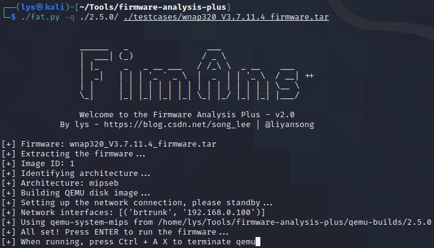

# firmware-analysis-plus

[](https://www.python.org/)
[](https://github.com/liyansong2018/firmware-analysis-plus/issues)
[](https://github.com/liyansong2018/firmware-analysis-plus/issues?q=is%3Aissue+is%3Aclosed)
[](https://github.com/liyansong2018/firmware-analysis-plus/blob/master/LICENSE)

上游项目支持：[binwalk](https://github.com/ReFirmLabs/binwalk)、[firmadyne](https://github.com/firmadyne/firmadyne)、[firmware-analysis-toolkit](https://github.com/attify/firmware-analysis-toolkit)

**firmware-analysis-plus**（**FAP**）主要用于常见**路由器固件的仿真**，能够用于固件的安全测试。感谢以下开源项目：`binwalk` 为我们提供了优秀的固件解压 API，`firmadyne` 为我们提供了优秀的固件仿真的核心支持，`firmware-analysis-toolkit` 为我们提供了简化流程的思想。

**FAP** 只是在前人的基础上，做出改进和定制。包括精简不必要组件，优化仿真流程，优化网络环境大幅压缩安装时间，修复若干 `bug`，一键仿真固件。其原理还是利用了 `qemu` 为我们提供的多个架构的模拟器去模拟硬件，利用 `libnvram` 的重写，`hook` 对若干硬件访问的函数。

| FAP 版本                                                     | python 版本      | 支持系统                                        | 安装方法                                                     |
| ------------------------------------------------------------ | ---------------- | ----------------------------------------------- | ------------------------------------------------------------ |
| [v0.1](https://github.com/liyansong2018/firmware-analysis-plus/releases/tag/0.1) | python2、python3 | Ubuntu16.04、Ubuntu 18.04、Kali 2020.02         | [FAP v0.1 版本手册](https://github.com/liyansong2018/firmware-analysis-plus/wiki/FAP-v0.1-%E7%89%88%E6%9C%AC%E6%89%8B%E5%86%8C) |
| [v1.0](https://github.com/liyansong2018/firmware-analysis-plus/releases/tag/1.0) | python2、python3 | beta                                            | beta                                                         |
| [v2.0](https://github.com/liyansong2018/firmware-analysis-plus/releases/tag/2.0) | python3          | Kali 2020.04（不支持 Ubuntu 20.04，其他未测试） | 如下所示                                                     |


## 安装 binwalk

以编译源码的方式安装`binwalk`，时至今日，`binwalk` 构建脚本中的诸多依赖已无法正常安装，于是自己 `fork` 了一份新的 `binwalk`，进行了修改。关于修改细节的描述，可参考：https://github.com/liyansong2018/binwalk

```
git clone https://github.com/liyansong2018/binwalk.git
cd binwalk
./deps.sh
sudo python3 setup.py install
```

## 安装 FAP

```shell
git clone https://github.com/liyansong2018/firmware-analysis-plus.git
cd firmware-analysis-plus
./setup.sh
```

## 配置

修改 `fat.config` 文件中的密码，改为 `root` 系统用户的密码

## 运行

```
./fat.py -q ./2.5.0/ ./testcases/wnap320_V3.7.11.4_firmware.tar
```



## 当生成的中间文件过多时，请删除中间文件

```shell
./reset.py
```

原始博客（已过时，不建议使用）: [使用 firmware-analysis-plus 一键模拟固件](https://blog.csdn.net/song_lee/article/details/105518309)

# V2.0 变化

- 安装流程进一步简化，增加新版本库的支持，删除冗余库
- 移除 `python2`，之前的版本需要 `python2` 和 `python3` 的同时支持
- 移除 `setup2kali.sh`，同时修改 `setup.sh`
- 修改 `firmadyne` 源码中的 `inferNetwork.sh` 文件
- 修改 `firmaydne` 源码中的 `extractor.py` 文件
- 修改 `binwalk` 安装脚本

欢迎提交修改代码，pull requests！

# FAQ

## FAP 支持的固件

FAP 通用版（上游 firmadyne 项目提供）

- [wnap320_V3.7.11.4_firmware.tar](https://github.com/liyansong2018/firmware-analysis-plus/tree/master/testcases)
- DIR-601_REVB_FIRMWARE_2.01.BIN
- DIR890A1_FW103b07.bin
- DIR-505L_FIRMWARE_1.01.ZIP
- DIR-615_REVE_FIRMWARE_5.11.ZIP
- DGL-5500_REVA_FIRMWARE_1.12B05.ZIP
- WRT54G3G_2.11.05_ETSI_code.bin
- NBG-416N_V1.00(USA.7)C0.zip
- TEW-638v2%201.1.5.zip
- Firmware_TEW-411BRPplus_2.07_EU.zip
- DGND3700 Firmware Version 1.0.0.17(NA).zip

FAP 定制版（针对特定固件定制的版本）

- [FAP-DIR2640.tar.bz2](https://github.com/liyansong2018/firmware-analysis-plus/releases)
